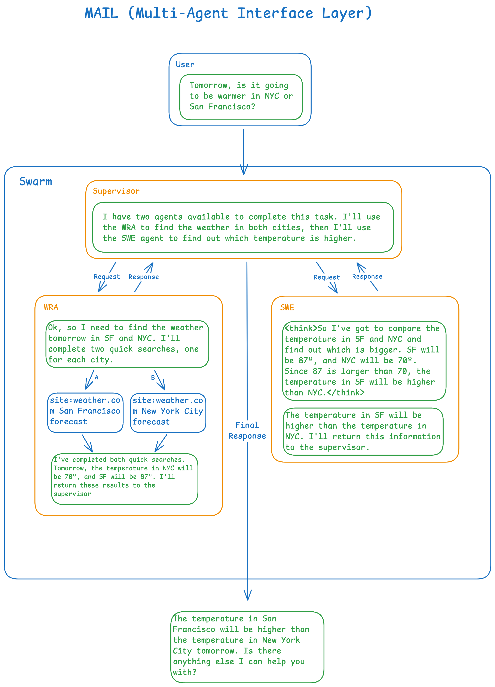

<p align="center">
  
</p>

# Multi-Agent Interface Layer (MAIL): Protocol and Swarm Reference Implementation

A standardized protocol for enabling autonomous agents to communicate, coordinate, and collaborate across distributed systems. MAIL facilitates complex multi-agent workflows, from simple task delegation within a single environment to sophisticated cross-organizational agent interactions spanning multiple networks and domains.

## Multi-Agent Interface Layer

![TODO]

## MAIL Swarm Reference Implementation

### Overview

This reference implementation demonstrates a complete MAIL-compliant multi-agent system built with Python and FastAPI. It showcases how autonomous AI agents can be organized into swarms, communicate using the standardized MAIL message format, and coordinate to solve complex tasks both within individual swarms and across distributed networks.

Key features of this implementation include:
- **Persistent Swarm Management**: Long-running agent swarms that maintain state and context
- **HTTP-based Communication**: RESTful API endpoints for external integration and interswarm messaging
- **Service Discovery**: Automatic registration and health monitoring of distributed swarms
- **Flexible Agent Architecture**: Configurable agents with specialized capabilities and communication patterns
- **Example Swarm**: A working demonstration with supervisor, weather, and math agents

The implementation serves as both a functional multi-agent system and a reference for building MAIL-compliant applications in various domains.

### Architecture

#### Key Components

1. **MAIL Core** (`src/mail/core.py`): The main orchestration engine that manages message queuing, agent interactions, and task execution
2. **FastAPI Server** (`src/mail/server.py`): HTTP API server providing REST endpoints for client interactions and interswarm communication
3. **Agent Swarms**: Collections of specialized AI agents that can communicate with each other
4. **Interswarm Router**: Enables communication between agents across different swarms via HTTP
5. **Swarm Registry**: Service discovery system for managing multiple swarms

#### Agent Types

The system comes with example agents:
- **Supervisor**: Orchestrates tasks and coordinates with other agents
- **Weather Agent**: Provides weather-related information and forecasts
- **Math Agent**: Handles mathematical calculations and analysis

### Prerequisites

- Python 3.12 or higher
- UV package manager (recommended) or pip
- LiteLLM proxy server (for LLM access and user authentication)

### Installation

1. Clone the repository:
```bash
git clone <repository-url>
cd mail
```

2. Install dependencies using UV:
```bash
uv sync
```

Or with pip:
```bash
pip install -e .
```

### Configuration

#### Required Environment Variables

For basic operation:
```bash
# Required for OpenAI API access (set up LiteLLM proxy)
LITELLM_PROXY_API_BASE=http://your-litellm-proxy-url
```

For interswarm messaging (optional):
```bash
# Swarm identification
SWARM_NAME=my-swarm-name          # Default: "default"
BASE_URL=http://localhost:8000     # Default: "http://localhost:8000"

# Optional database connection
DATABASE_URL=your-database-url     # Default: "none"
```

#### Swarm Configuration

The system uses a single JSON configuration file to define swarms:

- `swarms.json`: Contains all accessible swarm definitions, including configurations for both single-swarm operation and multi-swarm deployments

Example swarm configuration:
```json
[
    {
        "name": "example",
        "version": "1.0.0",
        "agents": [
            {
                "name": "supervisor",
                "factory": "src.mail.factories.supervisor:supervisor_factory",
                "llm": "openai/o3-mini",
                "system": "src.mail.examples.supervisor.prompts:SYSPROMPT",
                "comm_targets": ["weather", "math"],
                "agent_params": { }
            },
            {
                "name": "weather",
                "factory": "src.mail.examples.weather_dummy.agent:factory_weather_dummy",
                "llm": "openai/o3-mini",
                "system": "src.mail.examples.weather_dummy.prompts:SYSPROMPT",
                "comm_targets": ["supervisor", "math"],
                "agent_params": { 
                    "actions": [
                        {
                            "name": "get_weather_forecast",
                            "description": "Get the weather forecast for a given location",
                            "parameters": { 
                                "type": "object",
                                "properties": {
                                    "location": { "type": "string", "description": "The location to get the weather forecast for" },
                                    "days_ahead": { "type": "integer", "description": "The number of days ahead to get the weather forecast for" },
                                    "metric": { "type": "boolean", "description": "Whether to use metric units" }
                                }
                            },
                            "function": "src.mail.examples.weather_dummy.actions:get_weather_forecast"
                        }
                    ]
                 }
            },
            {
                "name": "math",
                "factory": "src.mail.examples.math_dummy.agent:factory_math_dummy",
                "llm": "openai/o3-mini",
                "system": "src.mail.examples.math_dummy.prompts:SYSPROMPT",
                "comm_targets": ["supervisor", "weather"],
                "agent_params": { }
            }
        ]
    }
]
```

### Running the Server

#### Option 1: Simple Server (Recommended for Testing)
```bash
# Using UV
uv run -m src.mail.server_simple

# Or with Python
python -m src.mail.server_simple
```

#### Option 2: Full Server with Interswarm Support
```bash
# Set environment variables
export SWARM_NAME=my-swarm
export BASE_URL=http://localhost:8000
export LITELLM_PROXY_API_BASE=http://your-litellm-proxy-url

# Start the server
uv run -m src.mail.server

# Or with Python
python -m src.mail.server
```

#### Option 3: Direct Execution
```bash
# Run the server directly
uv run python src/mail/server.py
```

The server will start on `http://localhost:8000` by default.

### API Usage

#### Authentication

All requests require a Bearer token in the Authorization header:
```bash
Authorization: Bearer your-api-token
```

#### Basic Endpoints

##### Health Check
```bash
curl http://localhost:8000/
```

##### Server Status
```bash
curl -H "Authorization: Bearer your-token" http://localhost:8000/status
```

##### Chat with Agents
```bash
curl -X POST http://localhost:8000/chat \
  -H "Content-Type: application/json" \
  -H "Authorization: Bearer your-token" \
  -d '{"message": "What is the weather like today?"}'
```

#### Interswarm Communication (Advanced)

##### List Available Swarms
```bash
curl http://localhost:8000/swarms
```

##### Register a New Swarm
```bash
curl -X POST http://localhost:8000/swarms/register \
  -H "Content-Type: application/json" \
  -d '{
    "name": "remote-swarm",
    "base_url": "http://localhost:8001",
    "auth_token": "optional-token"
  }'
```

##### Send Interswarm Message
```bash
curl -X POST http://localhost:8000/interswarm/send \
  -H "Content-Type: application/json" \
  -H "Authorization: Bearer your-token" \
  -d '{
    "target_swarm": "remote-swarm",
    "message": "Hello from local swarm!",
    "user_token": "your-user-token"
  }'
```

### Multi-Swarm Deployment

To set up multiple communicating swarms:

#### Terminal 1: Start First Swarm
```bash
export SWARM_NAME=swarm-alpha
export BASE_URL=http://localhost:8000
export LITELLM_PROXY_API_BASE=http://your-litellm-proxy-url
uv run -m src.mail.server
```

#### Terminal 2: Start Second Swarm
```bash
export SWARM_NAME=swarm-beta
export BASE_URL=http://localhost:8001
export LITELLM_PROXY_API_BASE=http://your-litellm-proxy-url
uv run -m src.mail.server
```

#### Register Swarms with Each Other
```bash
# Register swarm-beta with swarm-alpha
curl -X POST http://localhost:8000/swarms/register \
  -H "Content-Type: application/json" \
  -d '{"name": "swarm-beta", "base_url": "http://localhost:8001"}'

# Register swarm-alpha with swarm-beta
curl -X POST http://localhost:8001/swarms/register \
  -H "Content-Type: application/json" \
  -d '{"name": "swarm-alpha", "base_url": "http://localhost:8000"}'
```

### Development

#### Project Structure
```
mail/
├── src/mail/
│   ├── __init__.py
│   ├── core.py              # Main MAIL orchestration engine
│   ├── server.py            # Full FastAPI server with interswarm support
│   ├── server_simple.py     # Simplified server for testing
│   ├── auth.py              # Authentication module
│   ├── message.py           # Message type definitions
│   ├── executor.py          # Action execution engine
│   ├── interswarm_router.py # Interswarm message routing
│   ├── swarm_registry.py    # Service discovery for swarms
│   ├── examples/            # Example agents and prompts
│   ├── factories/           # Agent factory functions
│   └── swarms/              # Swarm management utilities
├── swarms.json              # Swarm definitions and configuration
└── pyproject.toml           # Project dependencies
```

#### Adding New Agents

1. Create agent implementation in `src/mail/examples/your_agent/`
2. Add agent configuration to `swarms.json`
3. Implement required factory function and prompts
4. Restart the server

### Authentication Setup

The system requires a LiteLLM proxy server for authentication. Set up the proxy and configure the `LITELLM_PROXY_API_BASE` environment variable to point to your proxy instance.

### Troubleshooting

#### Common Issues

1. **Server won't start**: Check that all required environment variables are set and the LiteLLM proxy is accessible
2. **Authentication errors**: Verify your API token is valid and the LiteLLM proxy is configured correctly
3. **Agent communication failures**: Check the swarm configuration in `swarms.json` and ensure all referenced agents exist
4. **Interswarm messaging issues**: Verify network connectivity between swarms and check that swarms are properly registered

#### Logs

The system uses Python logging. Enable debug logging to see detailed message flow:
```bash
export PYTHONPATH=src
python -c "import logging; logging.basicConfig(level=logging.DEBUG)"
```

### Security Considerations

- Use HTTPS in production deployments
- Implement proper authentication tokens for interswarm communication
- Consider rate limiting for public-facing endpoints
- Validate all incoming messages and parameters
- Use secure networks for swarm-to-swarm communication

### Contributing

1. Fork the repository
2. Create a feature branch
3. Add tests for new functionality
4. Submit a pull request

### License

![TODO]

### Additional Resources

- See `INTERSWARM_README.md` for detailed interswarm messaging documentation
- Check the `examples/` directory for agent implementation examples
- Review `factories/` for agent creation patterns